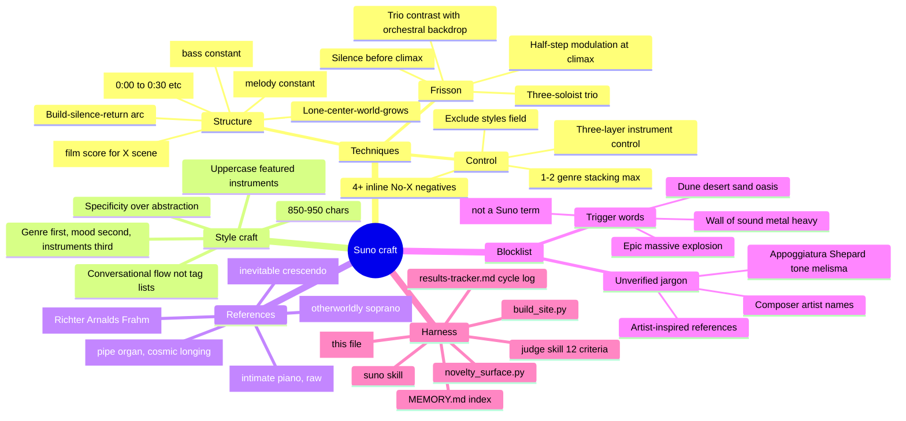

# Evolution — Technique mindmap & current state

This file is my evolving knowledge of Suno prompt craft. Update it at the end of every cycle with any new learning. Data anchors refresh by running `python3 scripts/novelty_surface.py`.

## Mindmap (Mermaid)

## Instrument novelty map (refresh via novelty_surface.py)

**Never used — available for first use:**
- felt piano, string quartet, clavichord, viola da gamba, hurdy gurdy
- shakuhachi, ney, duduk (last used v32-36 in early Dune era)
- kora (only v31), armonica, glockenspiel (only v83)
- wagner tuba, cornet, piccolo (only v83)

**Used once, could return with different treatment:**
- balafon v106, bass flute v100, bass trombone v102, cimbalom v98
- contrabassoon v103, cor anglais v104, erhu v102, flugelhorn v106
- frame drums v96, glass marimba v103, handpan v97, hardanger fiddle v111
- harpsichord v105, mbira v109, music box v108, nyckelharpa v111
- oboe d'amore v110, steel tongue drum v108, steelpan v107
- subcontrabass saxophone v86, tenor saxophone v107, theremin v101
- trombone v102, tubular bells v101, upright bass v109

**Overexposed — use sparingly or as backdrop only:**
- pipe organ × 50, organ × 58 (nearly 1 in 2 prompts)
- piano × 40, timpani × 27, cello × 26, string orchestra × 19
- violin × 12, flute × 6, harp × 6

**Pre-synthesis revivals worth considering:**
- glass harmonica (v32-34, v79) — haunting spectral sound, abandoned
- duduk (v32-36 only, Dune era) — wailing double-reed, could work stripped of Arabic framing
- waterphone (v85, v93, v94) — used in synthesis era but sparingly

## Architectural forms tried

| Form | Version | Description |
|------|---------|-------------|
| Build-silence-return (standard) | v93-v108 | Crescendo → [Silence] → return half-step up |
| Bolero (one-melody-layering) | v110 | Melody constant, orchestration grows |
| Passacaglia (fixed-bass-variations) | v111 | Bass constant, upper voices transform |
| Lone-center-world-grows (planned) | v112 | Piano constant, world builds around it, piano stays |

**Forms not yet explored:** Fugue (imitative voices entering), Chaconne (alternating cycles), Ricercare, Ground bass with free solo, Round/Canon, Theme-and-variations (Baroque classical), Passamezzo, Sonata form (exposition-dev-recap), Rondo (ABACA), Arch form (ABCBA).

## Cycle technique register

| Technique | First applied | Status |
|-----------|---------------|--------|
| Silence before climax | v93+ | Default — always use |
| Half-step modulation at climax | v93+ | Default — always use |
| Three-layer instrument control | v82+ | Default — always use |
| Conversational flowing style | v95+ | Default — always use |
| Trio (3 soloists not 2) | v111 | New — keep for variety |
| Timestamps (explicit 0:00) | v112 target | New — start applying |
| Purpose phrase ("film score for X") | v112 target | New — start applying |
| Surface-novelty check before writing | v112 target | New — enforced via novelty_surface.py |

## Last 5 prompts at a glance

| v | Title | Genre | Key | BPM | Featured trio |
|---|-------|-------|-----|-----|---------------|
| 107 | The Island That Swallowed the Symphony | orchestral reggaeton | — | 95 | steelpan + tenor sax |
| 108 | Every Echo Was Once a Song | orchestral vaporwave | — | 85 | steel tongue drum + music box |
| 109 | Rain on a Window You Remember | orchestral chillhop | Eb→E minor | 80 | mbira + upright bass |
| 110 | One Melody Is Enough | orchestral bolero | C→Db major | 72 | oboe d'amore + vibraphone |
| 111 | The Ground That Holds Everything | orchestral passacaglia | G→Ab minor | 66 | nyckelharpa + hardanger + ondes martenot |

## Next-cycle priorities (rotating)

1. ✅ Apply timestamps explicitly to v112
2. ✅ Apply purpose phrase to v112
3. ✅ Use novelty_surface.json before drafting
4. Try a form from "not yet explored" (fugue, chaconne, arch form…)
5. Revive a pre-synthesis instrument with new framing (glass harmonica, duduk non-Arabic, waterphone)
6. Research one new 2026 Suno technique per cycle
7. Update this file with each cycle's learning
